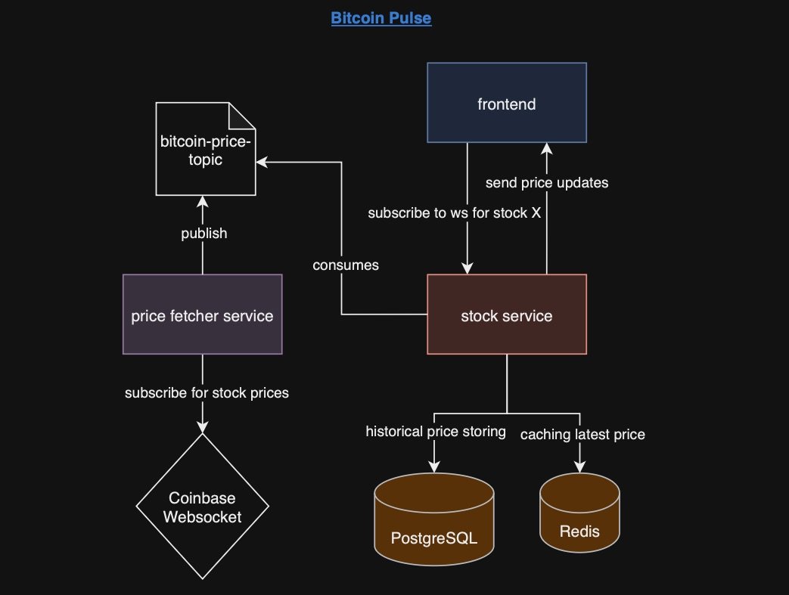

# Bitcoin Pulse


Bitcoin Pulse is a real-time cryptocurrency tracker that fetches live Bitcoin prices using the Coinbase Websocket Feed
and displays the data on an interactive graph. The application is built using a microservices architecture,
leveraging Spring Boot, Kafka, and React to provide a scalable and efficient solution for real-time tracking.

[](https://opensource.org/licenses/MIT)

## Tech Stack


## Features

* Real-time Bitcoin price tracking.
* Kafka-based messaging for publishing and consuming price updates.
* Interactive graphical visualization of Bitcoin prices.

## Architecture



## Getting Started

These instructions will get you a copy of the project up and running on your local machine for development and testing
purposes.

### Installation

A `docker-compose.yaml` is available to run Kafka and Zookeeper images, use the following commands if you see the need:

Docker run images

```bash
docker compose up -d
```

Docker stop images

```bash
docker compose down -v
```

## Open Source files

For more information about the project and how to contribute, please refer to the following files:

- [CONTRIBUTING](CONTRIBUTING.md)
- [CODE_OF_CONDUCT](CODE_OF_CONDUCT.md)
- [LICENSE](LICENSE)

## License

This project is lisenced under the MIT License - see the [LICENSE](LICENSE) file for details.

## Acknowledgments

Thanks to all contributors who decide to participate in this project.
