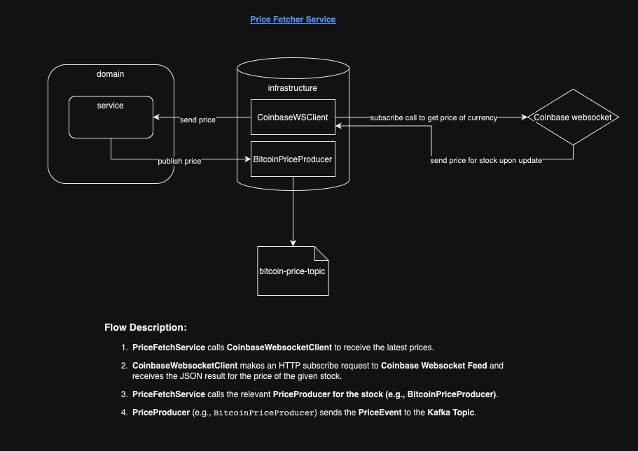

# Price Fetcher Service

[](https://www.oracle.com/java/technologies/javase-jdk17-downloads.html)
[](https://spring.io/projects/spring-boot)
[](https://spring.io/projects/spring-kafka)
[](https://maven.apache.org/)
[](https://opensource.org/licenses/MIT)

## Table of Contents

- [Introduction](#introduction)
- [Features](#features)
- [Architecture](#architecture)
- [Prerequisites](#prerequisites)
- [Installation](#installation)
- [Configuration](#configuration)
- [Running the Service](#running-the-service)

## Introduction

The **Price Fetcher Service** is a robust and scalable Java-based application designed to fetch real-time price data
from **Coinbase** using **Coinbase Websocket Feed**.
Leveraging the power of Spring Boot and Spring Kafka, this service ensures efficient data retrieval, processing, and
distribution using Kafka Topics for loose coupling between microservices, and high-throughput data streams.
Whether you're building a trading platform, analytics dashboard, or any financial application requiring up-to-the-second
price information, the Price Fetcher Service provides a reliable backbone to support your needs.

## Features

* **Real-Time Data Fetching**: Continuously retrieves price data from Coinbase Websocket feed.
* **Scalable Architecture**: Built with Spring Boot and Spring Kafka to handle high-throughput data streams.
* **Kafka Integration**: Seamlessly publishes fetched price data to Kafka topics for consumption by other services.
* **Configurable Endpoints**: Easily add or modify data sources through flexible configuration.
* **Monitoring&Logging**: Integrated with logging frameworks for real-time monitoring and troubleshooting.
* **Security**: Supports secure connections and authentication mechanisms for data sources and Kafka brokers.
* **Docker Support**: Containerized for easy deployment and scalability using Docker.

## Architecture



## Prerequisites

Before setting up the Price Fetcher Service, ensure that your environment meets the following requirements:

* Java Development Kit (JDK) 17 or Higher: Ensure that JDK 17 is installed and configured on your machine.
* Maven 3.8.5 or Higher: Maven is used for project build and dependency management.
* Apache Kafka: A running Kafka cluster is required to publish and consume price data.
* Docker (Optional): For containerizing and deploying the service using Docker.

## Installation

1. **Clone the Repository:**

    ```bash
    git clone https://github.com/ZiyadBouazara/bitcoin-pulse/pricefetcherservice.git
    cd pricefetcherservice
    ```

2. **Install Dependencies:**

   Ensure you're inside the project directory.

    ```bash
    mvn clean install
    ```

## Configuration

The Price Fetcher Service is highly configurable to accommodate different environments and requirements.
Configuration is managed through the `application.properties` file located in the `src/main/resources/` directory.

Here is an example that you can use:

```env
server.port=8082
spring.kafka.producer.bootstrap-servers=localhost:9092
spring.kafka.producer.key-serializer=org.apache.kafka.common.serialization.StringSerializer
spring.kafka.producer.value-serializer=org.springframework.kafka.support.serializer.JsonSerializer
spring.kafka.producer.properties.spring.json.add.type.headers=false
spring.kafka.bitcoin.price.topic.name=bitcoin-price-topic
coinbase.ws.url=wss://ws-feed.exchange.coinbase.com
```

## Running the service

1. **Run Kafka and Zookeeper:**

   Two options: Either you run your own instances of Kafka and Zookeeper, OR you can use the `docker-compose.yaml` at
   the root fo the Bitcoin Pulse project that will run the images for you.


2. **Build and run the service:**
   You can either use Maven and CLI commands to run the project, OR use the `Dockerfile` to run an image of the service.
