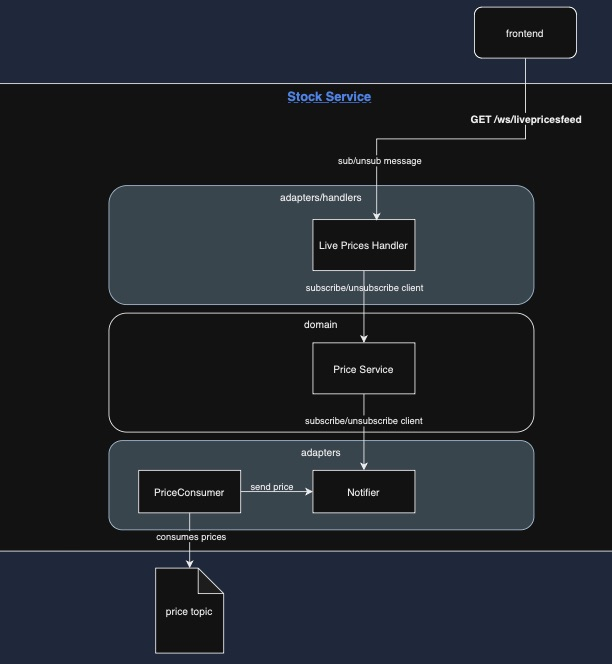

# Go Stock Service


## Table of Contents

- [Introduction](#introduction)
- [Features](#features)
- [Architecture](#architecture)
- [Prerequisites](#prerequisites)
- [Installation](#installation)
- [Configuration](#configuration)
- [Running the Service](#running-the-service)

## Introduction

The **Go Stock Service** is a high-performance, scalable service built with Go that consumes stock price data from a Kafka broker. It processes real-time stock information, making it ideal for applications requiring up-to-date financial data. Whether you're building a trading platform, analytics dashboard, or any financial application, this service provides a robust foundation for handling stock data efficiently.

## Features

- **Real-Time Data Consumption:** Connects to Kafka to consume live stock price updates.
- **Scalable Architecture:** Designed to handle high-throughput data streams.
- **Configurable:** Easily configurable through environment variables.
- **Logging & Monitoring:** Integrated logging for easy debugging and monitoring.
- **Graceful Shutdown:** Ensures all processes terminate smoothly without data loss.
- **Error Handling:** Robust error handling mechanisms to maintain service reliability.

## Architecture



1. **Kafka Broker:** Acts as the central hub for stock price data.
2. **Go Stock Service:** Consumes data from Kafka, processes it, and performs necessary actions.
3. **Storage/Database (Optional):** Stores processed data for further analysis or retrieval.
4. **Monitoring Tools:** Keeps track of service performance and health.

## Prerequisites

Before setting up the Go Stock Service, ensure you have the following installed:

- **Go:** [Download and Install Go](https://golang.org/dl/)
- **Kafka:** [Download and Install Apache Kafka](https://kafka.apache.org/quickstart)

## Installation

1. **Clone the Repository:**

    ```bash
    git clone https://github.com/ZiyadBouazara/bitcoin-pulse/stockservice-go.git
    cd stockservice-go
    ```

2. **Install Dependencies:**

   The project uses Go modules. Ensure you're inside the project directory.

    ```bash
    go mod download
    ```

## Configuration

The service is configured using environment variables defined in a `.env` file. Create a `.env` file in the root directory of the project with the following content:

```env
SERVER_PORT=:3000
# Kafka Configuration
KAFKA_BROKER_URL=localhost:9092
KAFKA_TOPIC=bitcoin-price-topic
KAFKA_GROUP_ID=stockservice-go-consumer
```
## Running the service

1. **Run Kafka and Zookeeper:**

    Two options: Either you run your own instances of Kafka and Zookeeper, OR you can use the `docker-compose.yaml` at the root fo the Bitcoin Pulse project that will run the images for you.


2. **Build and run the service:**

    ```bash
   make build
    ```
    ```bash
   make run
    ```
   
## Using the Service

To receive live price updates for stocks or cryptocurrencies, you can connect to the WebSocket endpoint provided by the service. This allows you to subscribe to real-time data streams and receive updates as they happen.

### **WebSocket Endpoints**

- **Development Environment:**

  ```
  GET ws://localhost:<your_port>/ws/livepricesfeed
  ```

- **Production Environment:**

  ```
  GET ws://bitcoinpulse.com/ws/livepricesfeed
  ```

Replace `<your_port>` with the appropriate port number you have configured for your development environment.

### **Subscription and Unsubscription Message Formats**

To manage your subscriptions, send JSON-formatted messages through the WebSocket connection.

#### **Subscribe to Live Price Updates**

**Message Format:**

```json
{
  "action": "subscribe",
  "symbol": "SYMBOL"
}
```

- **`action`**: Set to `"subscribe"` to initiate a subscription.
- **`symbol`**: The ticker symbol of the stock or cryptocurrency you want to track (e.g., `"BTC-USD"` for Bitcoin in USD).

**Example:**

```json
{
  "action": "subscribe",
  "symbol": "BTC-USD"
}
```

#### **Unsubscribe from Live Price Updates**

**Message Format:**

```json
{
  "action": "unsubscribe",
  "symbol": "SYMBOL"
}
```

- **`action`**: Set to `"unsubscribe"` to terminate the subscription.
- **`symbol`**: The ticker symbol of the stock or cryptocurrency you want to stop tracking.

**Example:**

```json
{
  "action": "unsubscribe",
  "symbol": "BTC-USD"
}
```

### **Receiving Live Updates**

Once subscribed, the server will send you real-time price updates for the requested symbol.

**Example of a Live Price Update Message:**

```json
{
  "symbol": "BTC-USD",
  "price": 100000.00,
  "timestamp": "2024-04-27T14:23:55Z"
}
```

- **`symbol`**: The ticker symbol of the stock or cryptocurrency.
- **`price`**: The current price.
- **`timestamp`**: The UTC time when the price was updated.
### **Connecting to the WebSocket Using JavaScript**

Below is a simple JavaScript example demonstrating how to connect to the WebSocket, subscribe to live price updates, and unsubscribe when needed.

```javascript
// Determine the WebSocket URL based on the environment
const isProduction = true; // Set to false for development
const wsUrl = isProduction 
    ? 'ws://bitcoinpulse.com/ws/livepricesfeed' 
    : 'ws://localhost:<your_port>/ws/livepricesfeed';

// Create a new WebSocket instance
const socket = new WebSocket(wsUrl);

// Event handler for connection open
socket.onopen = function(event) {
    console.log('WebSocket connection established.');

    // Subscribe to a symbol (e.g., Bitcoin in USD)
    const subscribeMessage = {
        action: "subscribe",
        symbol: "BTC-USD"
    };
    socket.send(JSON.stringify(subscribeMessage));
    console.log('Subscribed to BTC-USD.');
};

// Event handler for receiving messages
socket.onmessage = function(event) {
    const data = JSON.parse(event.data);
    console.log(`Received data:`, data);
};

// Event handler for errors
socket.onerror = function(error) {
    console.error('WebSocket error:', error);
};

// Event handler for connection close
socket.onclose = function(event) {
    if (event.wasClean) {
        console.log(`WebSocket connection closed cleanly, code=${event.code} reason=${event.reason}`);
    } else {
        console.warn('WebSocket connection closed unexpectedly.');
    }
};

// Function to unsubscribe from a symbol and close the WebSocket connection
function unsubscribeAndClose(symbol) {
    if (socket.readyState === WebSocket.OPEN) {
        const unsubscribeMessage = {
            action: "unsubscribe",
            symbol: symbol
        };
        socket.send(JSON.stringify(unsubscribeMessage));
        console.log(`Unsubscribed from ${symbol}.`);
    }

    // Close the WebSocket connection
    socket.close(1000, 'Client initiated closure'); // 1000 indicates a normal closure
}

// Example: Unsubscribe after 60 seconds
setTimeout(() => {
    unsubscribeAndClose("BTC-USD");
}, 60000); // 60000 milliseconds = 60 seconds
```


### **Best Practices**

- **Handle Reconnection Logic:** Implement logic to reconnect automatically if the WebSocket connection drops unexpectedly.

  ```javascript
  socket.onclose = function(event) {
      console.log('WebSocket closed. Attempting to reconnect in 5 seconds...');
      setTimeout(() => {
          // Re-establish the WebSocket connection
          // You might want to encapsulate the connection logic in a function
      }, 5000);
  };
  ```

- **Validate Incoming Data:** Always validate and sanitize the data received from the WebSocket to prevent potential security issues.

- **Manage Subscriptions Efficiently:** Keep track of your active subscriptions to avoid duplicate subscriptions or unnecessary network usage.

- **Error Handling:** Implement comprehensive error handling to manage different error scenarios gracefully.
